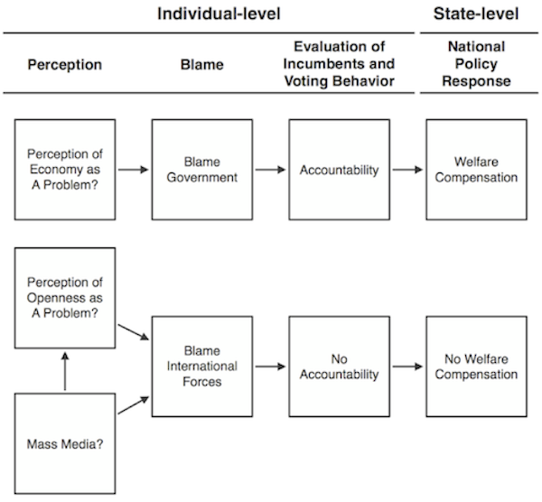
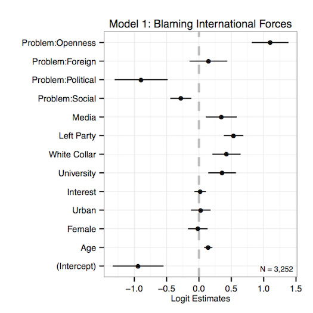
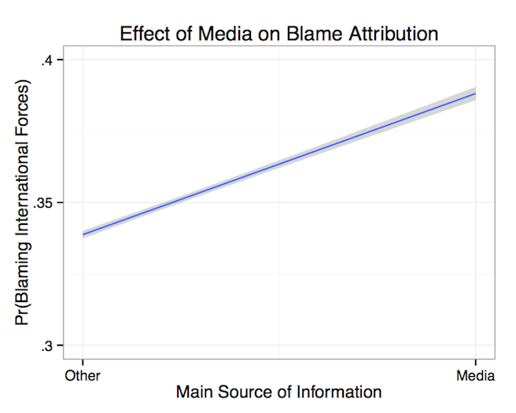
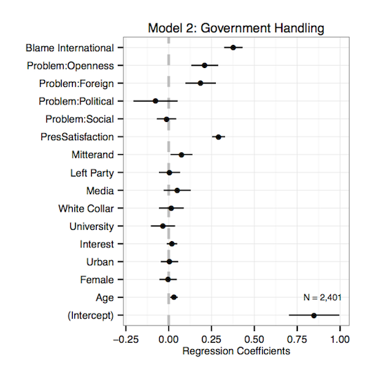
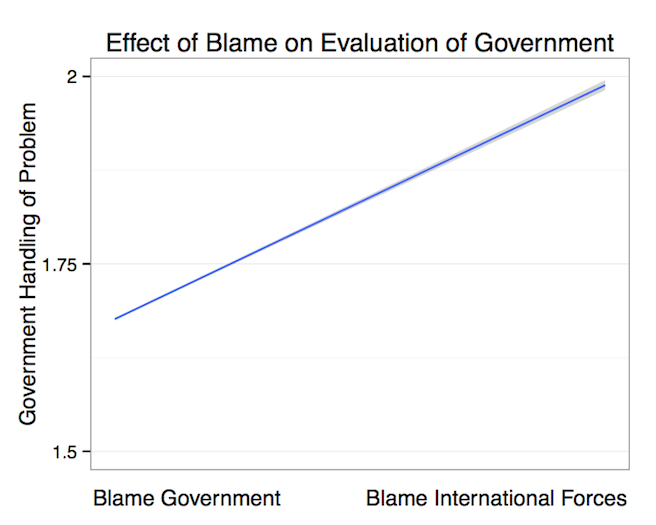
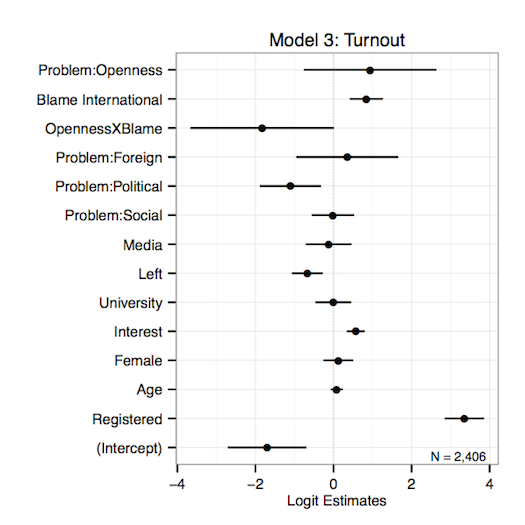
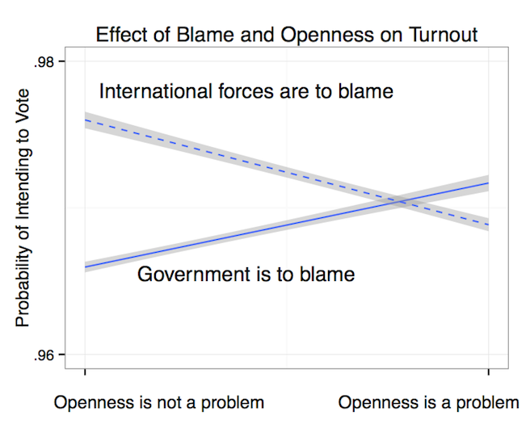
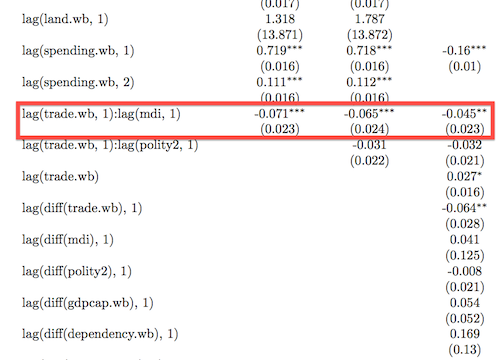

### Overview

1. The Research Question
2. A Theory
2. Research Strategy
3. Evidence
4. Conclusion

---

### The Research Question

> 1. Previous research has shown that welfare states expand to compensate the domestic "losers" from economic globalisation.
>   * Ruggie 1982; Katzenstein 1985; Rodrik 1998; Adserà and Boix 2002.
> 2. This argument assumes a threat of mobilisation by the domestic losers.
> 3. But what if the mass media shape perceptions of economic globalisation?
>   * If so, could this affect the propensities of aggrieved groups to mobilise?
>   * If so, could the spread of mass media explain patterns of policy response to globalisation across countries and over time?

---

### A Theory

> 1. Mass media tend to divert blame for the domestic costs of economic liberalisation, away from governments and onto global market pressures.
>  * Through issue-framing (Iyengar 1987, 1991).
>  * Through indexing reportage to the claims of politicians (Bennett 1990; Zaller and Chiu 1996),
>  who avoid blame whenever possible (Weaver 1986; McGraw 1990).
> 2. As a result, I argue that exposure to mass media will make individuals less likely to punish a government for income losses due to economic liberalisation.
> 3. Consequently, I expect that levels of mass media penetration within states will decrease the responsiveness of government spending to international trade exposure.

---

---

### Research Strategy

> 1. I test the individual-level implications by exploiting a little-known survey of French citizens taken in 1992-1993 (Chrique 1993).
> 2. I test the state-level implications using cross-sectional, time-series data for more than a hundred countries between 1960 and 2010.
>   * Economic data come from the World Bank's World Development Indicators.
>   * Media data come from Banks' Cross-National Time-Series Data Archive and the World Bank.
>   * I consider a simple additive index of radio, television, and newspapers per capita (Warren 2013).

---

##### Do the media affect blame attributions?

---

---

##### Does blame affect evaluations? 

---

---

##### Does blame affect voting behavior?

---

---

##### Do the media condition the correlation between trade openness and domestic spending?     

---

### Conclusion

> 1. Survey data furnish evidence that mass media diffuse blame for the domestic costs of economic liberalisation, away from governments and toward unaccountable international forces.

> 2. This shift of blame is associated with shifts in evaluations and behavior, which weaken the incentives for policymakers to compensate domestic losers from globalisation.

> 3. State-level data furnish evidence that policymakers indeed spend less in response to trade openness as levels of mass media increase.

---

### Thank you!

The full paper and all the source code behind these analyses and slides are available via:
  - [jmrphy.net/research](http://jmrphy.net/research)

Stay in touch!
  - j.murphy@soton.ac.uk
  - [@jmrphy](http://twitter.com/jmrphy)

